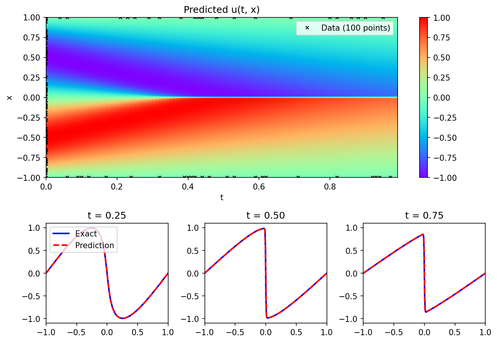

# Reproducing a Physics-Informed Neural Network for Burgers' Equation

A clean PyTorch reproduction of the continuous-time Burgers' equation example
from the seminal PINN paper:

> Raissi, M., Perdikaris, P., & Karniadakis, G. E. (2017).
> *Physics Informed Deep Learning (Part I): Data-driven Solutions of
> Nonlinear Partial Differential Equations.*
> [arXiv:1711.10561](https://arxiv.org/abs/1711.10561)

---

## Result

| | Relative L2 error |
|---|---|
| Original paper | 6.7 × 10⁻⁴ |
| This reproduction | 4.95 × 10⁻³ |



The network accurately captures the sharp internal shock layer near x = 0
that develops around t = 0.4 — a feature that is notoriously difficult for
classical numerical solvers without fine mesh refinement.

---

## What this is

Burgers' equation is a nonlinear PDE from fluid mechanics:

```
u_t + u·u_x − (0.01/π)·u_xx = 0,   x ∈ [−1, 1],  t ∈ [0, 1]
u(0, x)  = −sin(πx)
u(t, −1) = u(t, 1) = 0
```

A physics-informed neural network (PINN) solves it by training a small neural
network to simultaneously:

- **Match data** — fit ~100 known values at the initial condition and boundaries
- **Obey physics** — keep the PDE residual near zero at 10,000 unlabeled
  collocation points scattered through the domain

No mesh. No time-stepping. Just a network, automatic differentiation, and
two loss terms added together.

---

## Repository structure

```
pinn-burgers-reproduction/
├── README.md
├── requirements.txt
├── report.md
├── data/
│   └── burgers_shock.mat          ← reference solution from the original authors
├── notebook/
│   └── pinn_burgers.ipynb         ← full implementation, cell by cell
└── results/
    └── burgers_pinn_result.png    ← reproduced Figure 1 from the paper
```

---

## How to run

```bash
git clone https://github.com/Sultik03/pinn-burgers-reproduction
cd pinn-burgers-reproduction
python3 -m venv venv
source venv/bin/activate          # on Windows: venv\Scripts\activate
pip install -r requirements.txt
jupyter notebook
```

Open `notebook/pinn_burgers.ipynb` and run all cells top to bottom.
Training takes roughly **5–10 minutes on CPU**.

---

## Notes on the reproduction

The original paper uses **TensorFlow 1.x** (2017). This reproduction uses
**PyTorch** — the math, architecture, and training procedure are identical;
only the framework differs.

The error (4.95 × 10⁻³) is slightly higher than the paper's (6.7 × 10⁻⁴),
which is expected: the paper trained on a GPU with full L-BFGS convergence,
while this run used a CPU with a capped iteration budget. The qualitative
result — accurate shock capture from only 100 data points — is fully reproduced.

---

## Citation

```bibtex
@article{raissi2017physics,
  title   = {Physics informed deep learning (part i): Data-driven solutions
             of nonlinear partial differential equations},
  author  = {Raissi, Maziar and Perdikaris, Paris and Karniadakis, George Em},
  journal = {arXiv preprint arXiv:1711.10561},
  year    = {2017}
}
```
