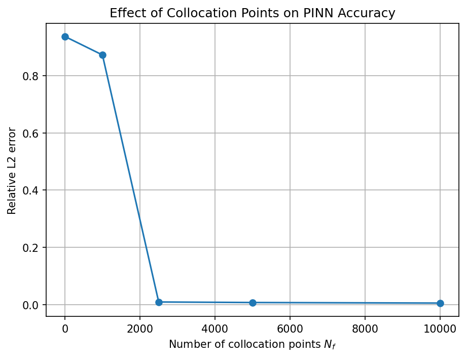
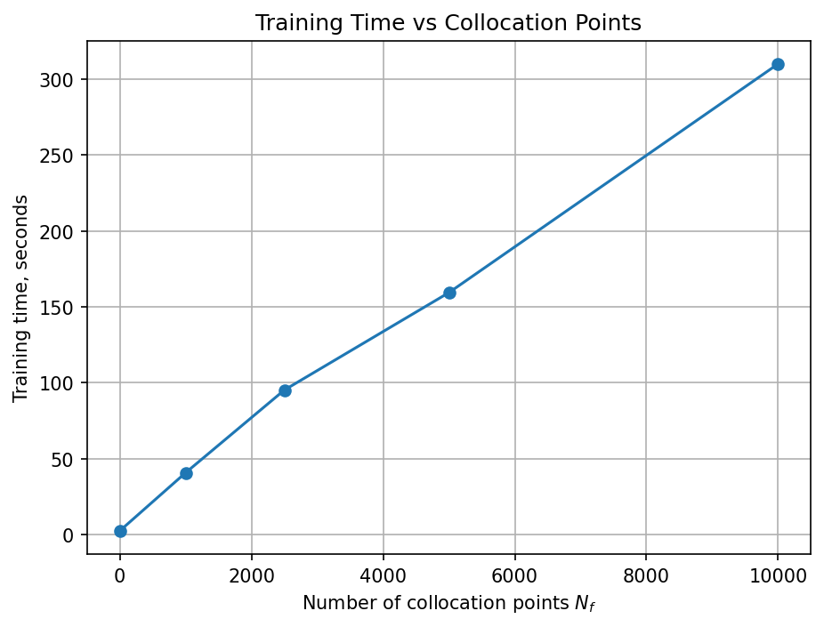
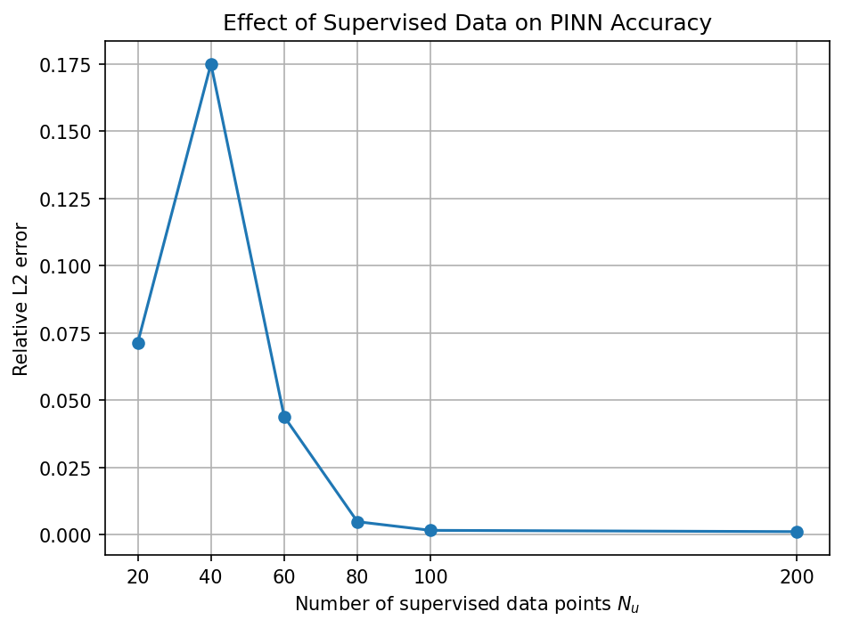
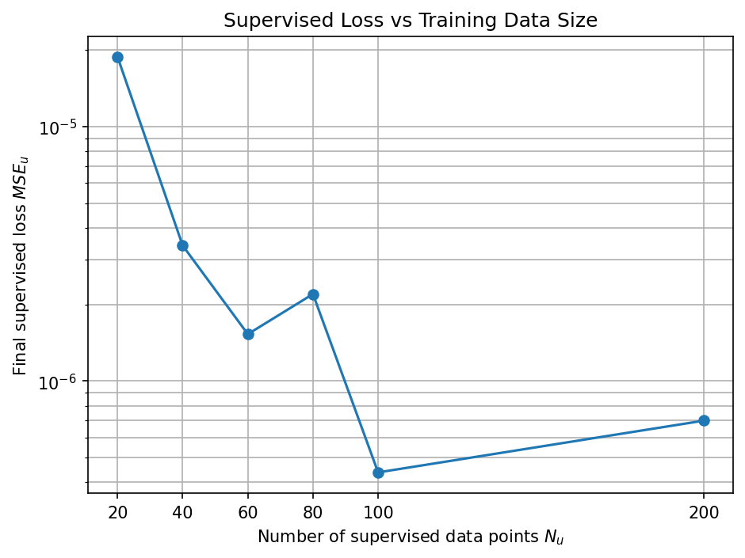
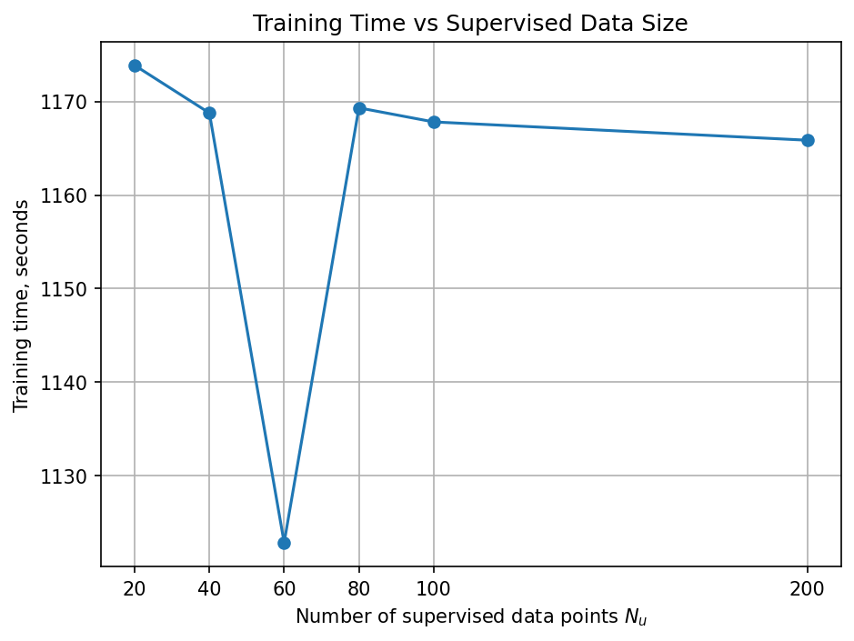
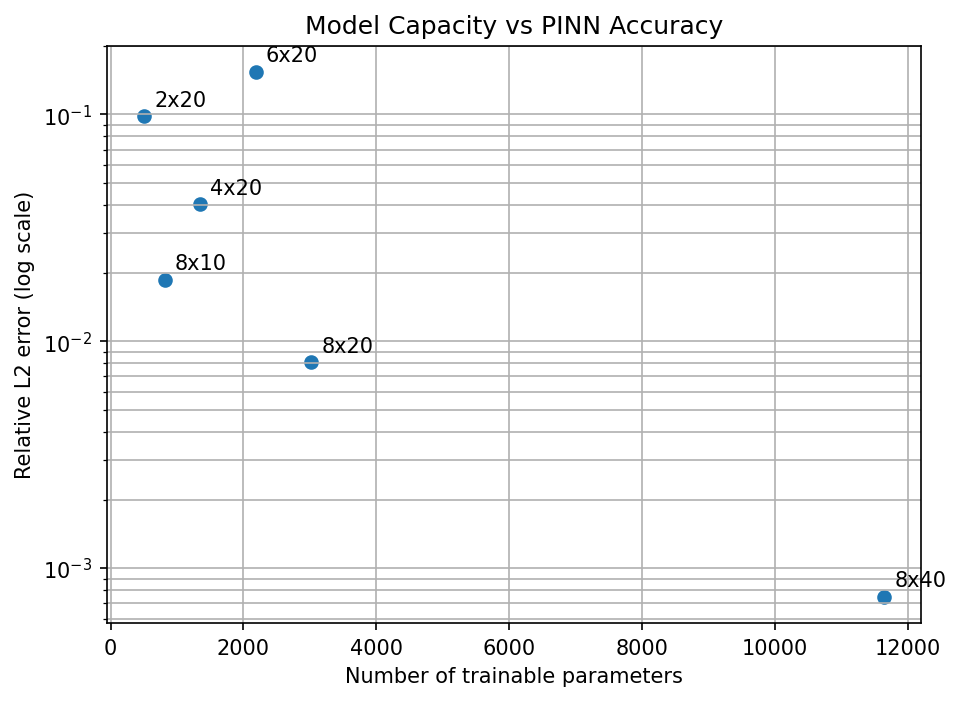
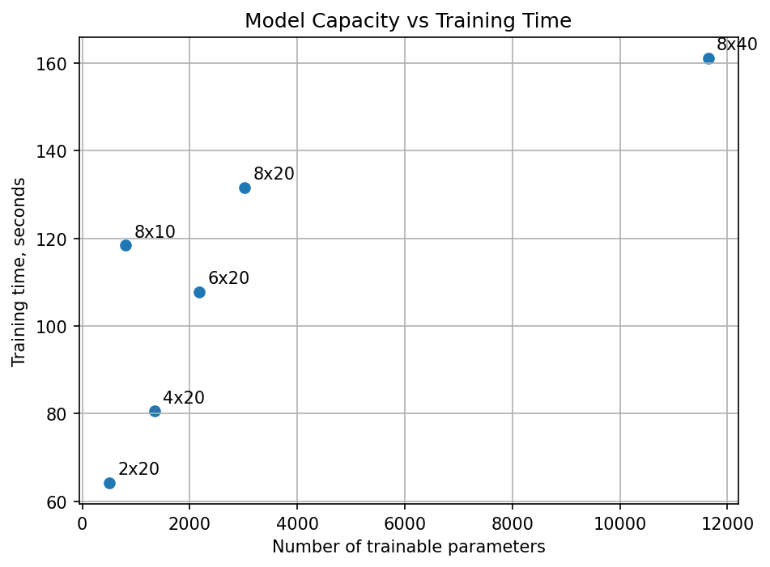

# Physics-Informed Neural Network for Burgers' Equation

A PyTorch reproduction and experimental analysis of the continuous-time Physics-Informed Neural Network (PINN) for the one-dimensional viscous Burgers' equation.

**Original paper:** [Physics Informed Deep Learning (Part I): Data-driven Solutions of Nonlinear Partial Differential Equations](https://arxiv.org/abs/1711.10561)

**Full report:** [`TECHNICAL_REPORT.md`](TECHNICAL_REPORT.md)

---

## Project overview

This repository contains four stages, presented in the order they were performed:

1. **Baseline reproduction** of the paper's Burgers' equation experiment
2. **Experiment 1:** collocation-point sweep
3. **Experiment 2:** supervised training-data sweep
4. **Experiment 3:** network architecture sweep

The goal is not merely to obtain one low error value. The project studies how physics constraints, supervised data quantity, and neural-network capacity affect PINN performance.

> **Important:** The experiments use different training configurations. Their best errors should not be treated as a single controlled leaderboard unless all settings are identical.

---

## Results at a glance

| Stage | Best tested configuration | Relative L₂ error |
|---|---|---:|
| Original paper | N_u = 100, N_f = 10,000, 8×20 | 6.70×10⁻⁴ |
| Baseline reproduction | N_u = 100, N_f = 10,000, 8×20 | 4.95×10⁻³ |
| Experiment 1 | N_f = 10,000 | 4.95×10⁻³ |
| Experiment 2 | N_u = 200 | 1.17×10⁻³ |
| Experiment 3 | 8×40 network | 7.48×10⁻⁴ |

The strongest modified model, `8×40`, reached an error only about **11.6% higher** than the value reported in the original paper. It is a sensitivity-study result, not an exact reproduction of the paper's baseline configuration.

---

## Problem formulation

The one-dimensional viscous Burgers' equation is

```math
u_t + u u_x - \frac{0.01}{\pi}u_{xx} = 0,
\qquad
x \in [-1,1],
\quad
t \in [0,1].
```

The initial and boundary conditions are

```math
u(0,x) = -\sin(\pi x),
```

```math
u(t,-1) = u(t,1) = 0.
```

The small viscosity produces a sharp internal layer near x = 0, making this equation a useful benchmark for testing whether a PINN can represent steep nonlinear behavior.

---

## PINN formulation

A fully connected neural network approximates the solution:

```math
u_\theta(t,x).
```

PyTorch automatic differentiation is used to calculate

```math
u_t,
\qquad
u_x,
\qquad
u_{xx}.
```

The PDE residual is

```math
f_\theta(t,x)
=
u_t
+
u_\theta u_x
-
\frac{0.01}{\pi}u_{xx}.
```

The total training loss is

```math
\mathcal{L}
=
\mathrm{MSE}_u
+
\mathrm{MSE}_f.
```

The supervised loss is

```math
\mathrm{MSE}_u
=
\frac{1}{N_u}
\sum_{i=1}^{N_u}
\left|
u_\theta(t_u^i,x_u^i)-u^i
\right|^2,
```

and the physics loss is

```math
\mathrm{MSE}_f
=
\frac{1}{N_f}
\sum_{i=1}^{N_f}
\left|
f_\theta(t_f^i,x_f^i)
\right|^2.
```

The collocation points do not contain exact solution values. They specify locations where the governing equation should be satisfied.

---

# Baseline reproduction

**Notebook:** [`notebook/pinn_burgers.ipynb`](notebook/pinn_burgers.ipynb)

## Configuration

| Component | Setting |
|---|---|
| Framework | PyTorch |
| Precision | `float64` |
| Inputs | t, x |
| Output | u(t, x) |
| Hidden layers | 8 |
| Neurons per hidden layer | 20 |
| Activation | `tanh` |
| Trainable parameters | 3,021 |
| Supervised points | N_u = 100 |
| Collocation points | N_f = 10,000 |
| Collocation sampling | Latin Hypercube Sampling |
| Optimizers | Adam (2,000 iterations) followed by L-BFGS (maximum 3,000 iterations) |
| Reference dataset | `data/burgers_shock.mat` |

## Result

| Source | Relative L₂ error |
|---|---:|
| Original paper | 6.70×10⁻⁴ |
| PyTorch reproduction | 4.95×10⁻³ |

The model reproduces the overall spatio-temporal field and closely follows the exact solution at t = 0.25, t = 0.50, and t = 0.75. Its numerical error is higher than the paper's result, so it should be described as a successful qualitative reproduction rather than an exact numerical match.


---

# Experiment 1: collocation-point sweep

**Notebook:** [`notebook/01_collocation_sweep.ipynb`](notebook/01_collocation_sweep.ipynb)

## Objective

This experiment varies the number of physics collocation points N_f while keeping

- N_u = 100,
- the `8×20` architecture,
- 3,021 trainable parameters

fixed.

The case N_f = 0 removes the physics residual entirely and acts as a data-only neural-network baseline.

All runs used random seed `1234`, double precision, 2,000 Adam iterations, and at most 3,000 L-BFGS iterations.

## Results

| `N_f` | Relative L₂ error | Final `MSE_u` | Final `MSE_f` | Training time |
|---:|---:|---:|---:|---:|
| 0 | 9.378×10⁻¹ | 1.780×10⁻⁷ | 0 | 3.2 s |
| 1,000 | 8.732×10⁻¹ | 5.942×10⁻³ | 3.149×10⁻³ | 51.1 s |
| 2,500 | 8.753×10⁻³ | 2.774×10⁻⁷ | 5.774×10⁻⁶ | 96.2 s |
| 5,000 | 6.906×10⁻³ | 4.964×10⁻⁷ | 3.951×10⁻⁶ | 161.4 s |
| 10,000 | 4.951×10⁻³ | 3.552×10⁻⁷ | 4.906×10⁻⁶ | 483.0 s |

## Analysis

- With N_f = 0, the network obtained an extremely small supervised loss but a relative L₂ error of approximately 0.94. It fitted the initial and boundary observations without learning the correct interior solution.
- Increasing N_f from 0 to 1,000 produced little improvement under this training setup.
- The main accuracy transition occurred between N_f = 1,000 and N_f = 2,500, where the error improved by almost **100 times**.
- Increasing N_f beyond 2,500 continued to improve accuracy, but with diminishing returns.
- Moving from 5,000 to 10,000 collocation points reduced error by about **28.3%**, while training time increased by almost **3 times**.
- Within this sweep, N_f = 5,000 offers a reasonable accuracy-runtime trade-off, while N_f = 10,000 gives the lowest error.

The data-only result is particularly important: a small supervised loss does not imply that the PDE solution is correct across the interior domain.

## Figures






## Files

- Raw results: [`collocation_sweep_results.csv`](results/experiment_1_collocation/collocation_sweep_results.csv)
- Summary table: [`collocation_sweep_summary.csv`](results/experiment_1_collocation/tables/collocation_sweep_summary.csv)

---

# Experiment 2: supervised training-data sweep

**Notebook:** [`notebook/02_training_data_sweep.ipynb`](notebook/02_training_data_sweep.ipynb)

## Objective

This experiment varies the number of supervised initial and boundary points N_u, while keeping N_f = 10,000 and the 3,021-parameter network fixed.

It tests how much direct solution data the PINN needs when the governing PDE is already included in the loss.

All runs used random seed `1234`, double precision, 2,000 Adam iterations, and at most 3,000 L-BFGS iterations. The same set of 10,000 collocation points was reused for every value of `N_u`, and the supervised samples were nested so that smaller datasets were subsets of larger ones.

## Results

| `N_u` | Relative L₂ error | Maximum absolute error | Final `MSE_u` | Training time |
|---:|---:|---:|---:|---:|
| 20 | 7.133×10⁻² | 7.601×10⁻¹ | 1.882×10⁻⁵ | 1173.9 s |
| 40 | 1.749×10⁻¹ | 1.587 | 3.409×10⁻⁶ | 1168.8 s |
| 60 | 4.391×10⁻² | 5.081×10⁻¹ | 1.529×10⁻⁶ | 1122.9 s |
| 80 | 4.870×10⁻³ | 4.815×10⁻² | 2.197×10⁻⁶ | 1169.3 s |
| 100 | 1.657×10⁻³ | 1.483×10⁻² | 4.372×10⁻⁷ | 1167.8 s |
| 200 | 1.175×10⁻³ | 6.886×10⁻³ | 6.985×10⁻⁷ | 1165.9 s |

## Analysis

- Accuracy improved dramatically between N_u = 60 and N_u = 80.
- Increasing N_u from 20 to 200 reduced relative L₂ error by approximately **60.7 times**.
- The trend was not monotonic: N_u = 40 performed worse than N_u = 20.
- The anomaly indicates that PINN performance depends on the sampled points, initialization, and optimizer trajectory, not only on data quantity.
- Improvements became smaller after N_u = 100, suggesting diminishing returns.
- Training time remained nearly constant across the sweep because the 10,000 collocation points dominated the computational cost.
- Final supervised loss did not perfectly predict global solution accuracy. A model can fit its supervised points well and still generalize poorly across the full domain.

## Figures








## Files

- Raw results: [`training_data_sweep_results.csv`](results/experiment_2_training_data/training_data_sweep_results.csv)
- Summary table: [`training_data_sweep_summary.csv`](results/experiment_2_training_data/tables/training_data_sweep_summary.csv)

---

# Experiment 3: network architecture sweep

**Notebook:** [`notebook/03_architecture_sweep.ipynb`](notebook/03_architecture_sweep.ipynb)

## Objective

This experiment studies the effect of network depth, width, parameter count, and runtime. Every architecture used the same supervised points and the same collocation points.

## Fixed settings

| Component | Setting |
|---|---|
| Supervised points | N_u = 100 |
| Collocation points | N_f = 5,000 |
| Activation | `tanh` |
| Random seed | `1234` |
| Precision | `float64` |
| Device used for the recorded runs | CUDA |
| Adam iterations | 2,000 |
| L-BFGS iterations | 3,000 |

## Results

| Architecture | Parameters | Relative L₂ error | Maximum absolute error | Training time |
|---|---:|---:|---:|---:|
| `2×20` | 501 | 9.802×10⁻² | 1.045 | 64.2 s |
| `4×20` | 1,341 | 4.015×10⁻² | 4.477×10⁻¹ | 80.6 s |
| `6×20` | 2,181 | 1.541×10⁻¹ | 1.435 | 107.8 s |
| `8×10` | 811 | 1.868×10⁻² | 2.007×10⁻¹ | 118.5 s |
| `8×20` | 3,021 | 8.071×10⁻³ | 7.914×10⁻² | 131.6 s |
| `8×40` | 11,641 | 7.476×10⁻⁴ | 8.439×10⁻³ | 161.1 s |

## Depth analysis

For networks with 20 neurons per hidden layer:

- `4×20` improved substantially over `2×20`.
- `6×20` performed worse than both shallower models.
- `8×20` produced the best result in the depth comparison.

Depth therefore did not produce a smooth or guaranteed improvement. A deeper network has more capacity, but it can also be more difficult to optimize within a fixed training budget.

## Width analysis

For networks with eight hidden layers:

| Width | Relative L₂ error |
|---:|---:|
| 10 | 1.868×10⁻² |
| 20 | 8.071×10⁻³ |
| 40 | 7.476×10⁻⁴ |

Increasing width produced a consistent improvement.

- `8×40` was approximately **25 times** more accurate than `8×10`.
- `8×40` was approximately **10.8 times** more accurate than `8×20`.
- Runtime increased from 118.5 seconds for `8×10` to 161.1 seconds for `8×40`.
- The best architecture reached a result close to the original paper, but it used a modified network and training setup.

## Parameter-count analysis

More parameters did not always lead to lower error. The `6×20` model had more parameters than `4×20` but performed substantially worse.

The relationship between capacity and accuracy is therefore mediated by optimization; parameter count alone did not determine predictive accuracy.

## Figures






## Files

- Raw results: [`architecture_sweep_results.csv`](results/experiment_3_architecture/architecture_sweep_results.csv)
- Summary table: [`architecture_sweep_summary.csv`](results/experiment_3_architecture/tables/architecture_sweep_summary.csv)

---

# Main conclusions

The experiments support five main conclusions.

1. **The PDE residual is essential.**  
   The data-only network achieved a tiny supervised loss but failed to recover the interior solution.

2. **A minimum collocation density was required in this setup.**  
   The largest improvement occurred between 1,000 and 2,500 collocation points.

3. **More supervised data generally improved accuracy, but not monotonically.**  
   Sampling and optimization caused a clear anomaly at N_u = 40.

4. **Width was more reliable than depth.**  
   Increasing width at eight layers produced consistent gains, while increasing depth gave irregular results.

5. **The central PINN claim was reproduced.**  
   A neural network constrained by Burgers' equation recovered the full solution from sparse initial and boundary observations.

---

# Repository structure

```text
pinn-burgers-reproduction/
├── README.md
├── TECHNICAL_REPORT.md
├── requirements.txt
├── data/
│   └── burgers_shock.mat
├── notebook/
│   ├── pinn_burgers.ipynb
│   ├── 01_collocation_sweep.ipynb
│   ├── 02_training_data_sweep.ipynb
│   └── 03_architecture_sweep.ipynb
└── results/
    ├── burgers_pinn_result.png
    ├── experiment_1_collocation/
    │   ├── collocation_sweep_results.csv
    │   ├── figures/
    │   │   ├── Nf_vs_relative_l2.png
    │   │   ├── Nf_vs_relative_l2_log.png
    │   │   └── Nf_vs_training_time.png
    │   └── tables/
    │       └── collocation_sweep_summary.csv
    ├── experiment_2_training_data/
    │   ├── training_data_sweep_results.csv
    │   ├── figures/
    │   │   ├── Nu_vs_final_mse_u.png
    │   │   ├── Nu_vs_relative_l2.png
    │   │   ├── Nu_vs_relative_l2_log.png
    │   │   └── Nu_vs_training_time.png
    │   └── tables/
    │       └── training_data_sweep_summary.csv
    └── experiment_3_architecture/
        ├── architecture_sweep_results.csv
        ├── figures/
        │   ├── depth_vs_relative_l2_log.png
        │   ├── parameters_vs_relative_l2.png
        │   ├── parameters_vs_training_time.png
        │   └── width_vs_relative_l2_log.png
        └── tables/
            └── architecture_sweep_summary.csv
```

---

# Installation

Clone the repository:

```bash
git clone https://github.com/your-username/pinn-burgers-reproduction.git
cd pinn-burgers-reproduction
```

Create and activate a virtual environment:

```bash
python3 -m venv venv
source venv/bin/activate
```

On Windows:

```bash
venv\Scripts\activate
```

Install the dependencies:

```bash
pip install -r requirements.txt
```

Start Jupyter:

```bash
jupyter notebook
```

---

# Execution order

Run the notebooks in this order:

```text
1. notebook/pinn_burgers.ipynb
2. notebook/01_collocation_sweep.ipynb
3. notebook/02_training_data_sweep.ipynb
4. notebook/03_architecture_sweep.ipynb
```

This order follows the logic of the study:

1. establish the baseline;
2. test the effect of the physics constraint;
3. test supervised-data efficiency;
4. test model capacity.

---

# Reproducibility notes

For reliable comparisons:

- fix NumPy and PyTorch seeds;
- record the exact supervised and collocation samples;
- use `float64` for stable second derivatives;
- keep optimizer settings fixed within each sweep;
- save raw CSV outputs;
- record runtime, device, and optimizer iteration counts;
- retain anomalous runs instead of silently removing them;
- repeat important configurations with multiple random seeds;
- report mean and standard deviation when repeated runs are available.

---

# Limitations

- The baseline error is higher than the value reported in the original paper.
- Most configurations were evaluated with a single random seed.
- The sweeps do not all use identical optimizer budgets and collocation counts.
- PINN training is sensitive to initialization, sampling, and optimizer convergence.
- Relative L₂ error can hide localized errors near the sharp internal layer.
- The best `8×40` result is a modified experiment, not the exact paper configuration.
- This repository reproduces only the continuous-time Burgers' equation example.
- The project does not claim that PINNs universally outperform classical numerical solvers.

---

# Citation

```bibtex
@article{raissi2017physics,
  title={Physics Informed Deep Learning (Part I): Data-driven Solutions of Nonlinear Partial Differential Equations},
  author={Raissi, Maziar and Perdikaris, Paris and Karniadakis, George Em},
  journal={arXiv preprint arXiv:1711.10561},
  year={2017}
}
```
