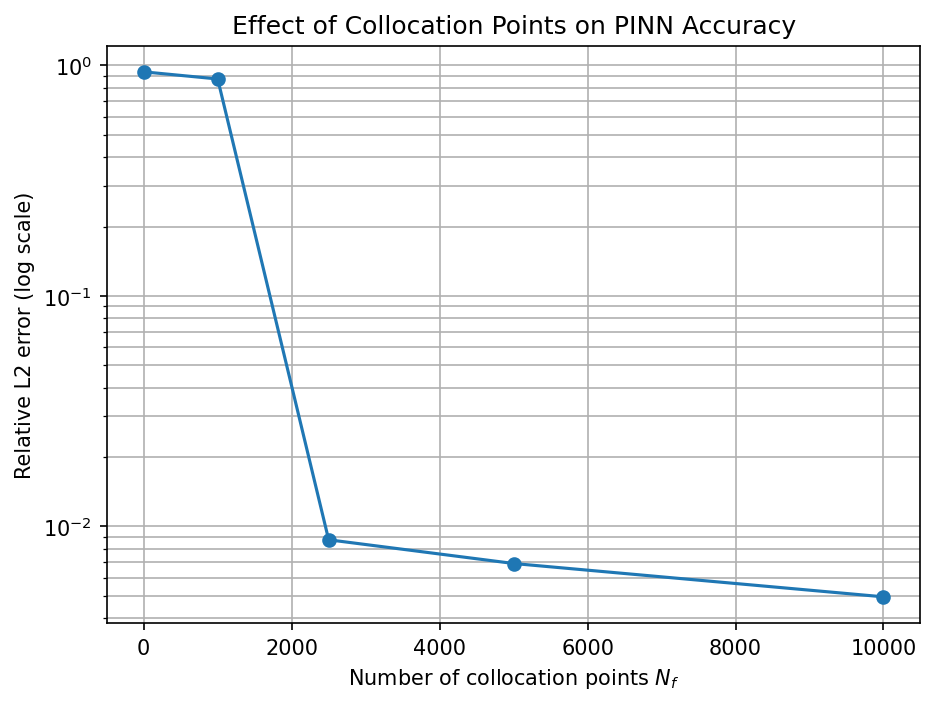
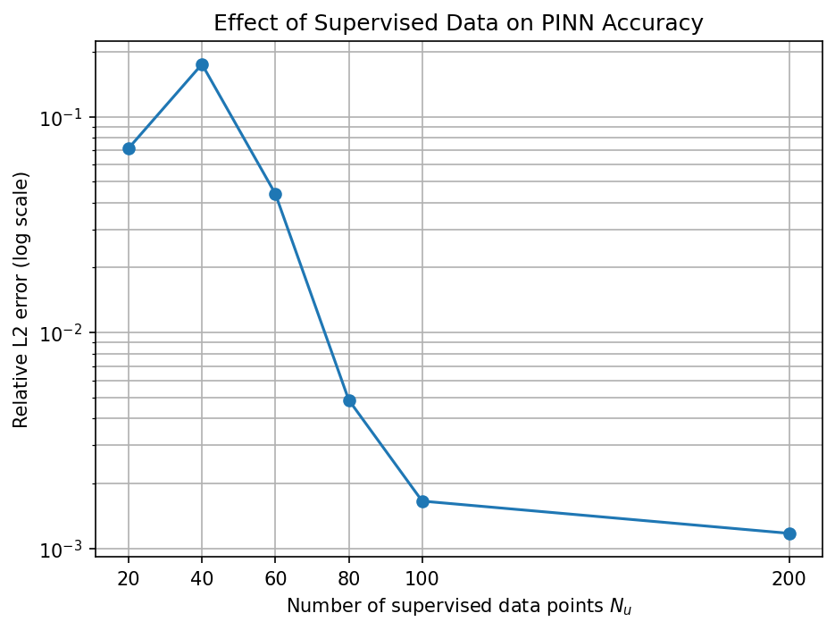
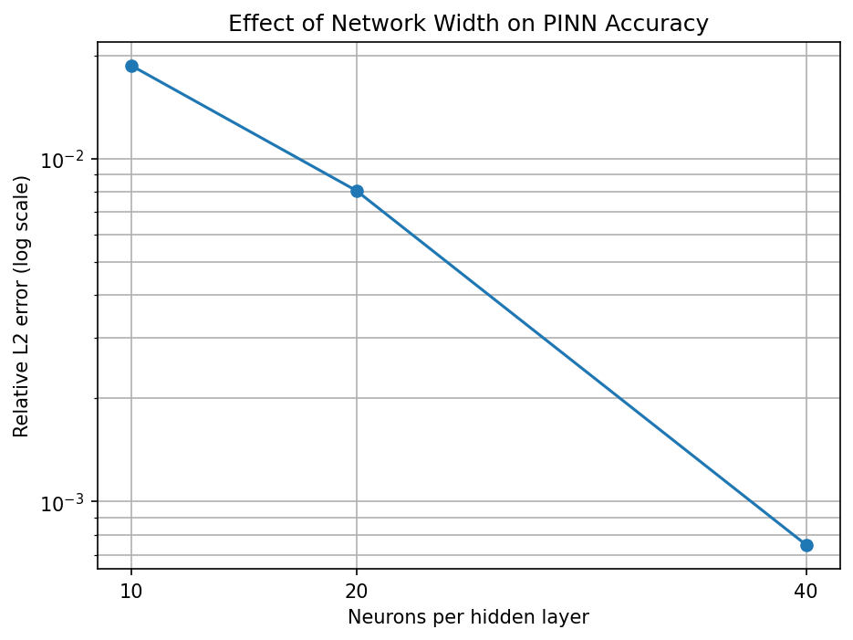
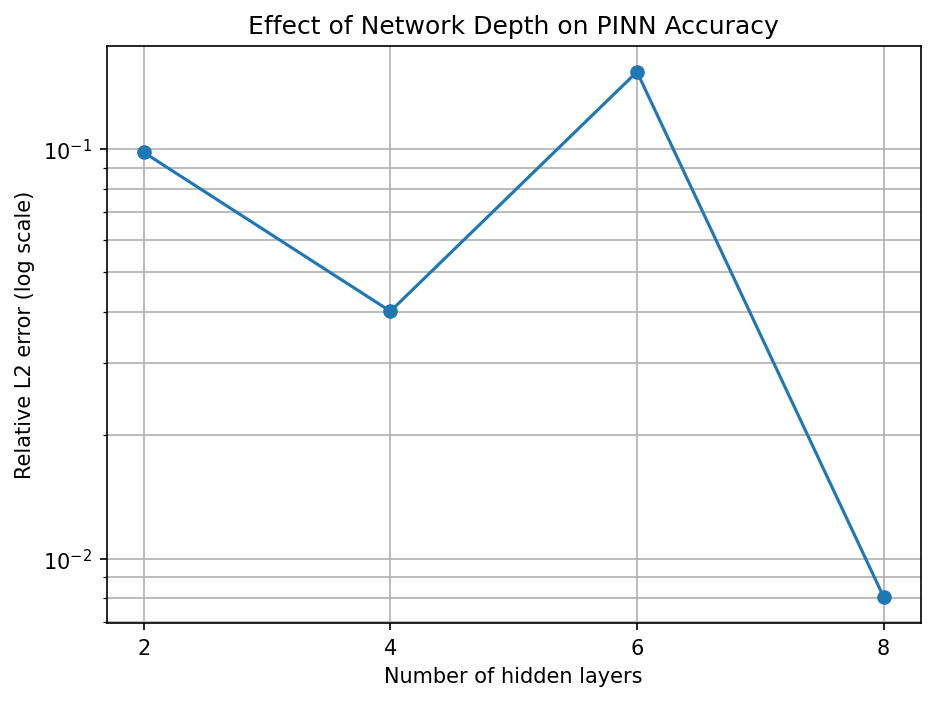

# Technical Report: Reproduction and Sensitivity Analysis of a PINN for Burgers' Equation

**Author:** Sultan  
**Date:** 13 July 2026  
**Original paper:** [Physics Informed Deep Learning (Part I): Data-driven Solutions of Nonlinear Partial Differential Equations](https://arxiv.org/abs/1711.10561)

---

## Abstract

This report presents a PyTorch reproduction of the continuous-time Physics-Informed Neural Network (PINN) used by Raissi, Perdikaris, and Karniadakis to solve the one-dimensional viscous Burgers' equation. The baseline model used 100 supervised initial and boundary points, 10,000 Latin Hypercube collocation points, and a fully connected network with eight hidden layers and 20 neurons per layer. It achieved a relative L₂ error of 4.951 × 10⁻³, compared with 6.70 × 10⁻⁴ reported in the original paper.

Three sensitivity experiments were then performed. The collocation-point sweep showed that a data-only model could fit the supervised points while failing across the interior domain, and that the largest accuracy improvement occurred between 1,000 and 2,500 collocation points in the recorded run. The supervised-data sweep showed a strong overall improvement as the number of initial and boundary observations increased, although the relationship was not monotonic. The architecture sweep showed that increasing depth did not guarantee better accuracy, while increasing width at a fixed depth of eight layers produced consistent gains. The best tested architecture, `8×40`, achieved a relative L₂ error of 7.476 × 10⁻⁴.

The results reproduce the central qualitative claim of the paper: the PDE residual enables a neural network to recover a full space-time solution from sparse supervised data. They also show that PINN performance depends strongly on collocation density, data selection, model capacity, and optimizer convergence.

---

## 1. Scope and objectives

This project reproduces the continuous-time Burgers' equation example from the original PINN paper. It does not reproduce the nonlinear Schrödinger equation, the Allen-Cahn equation, or the discrete-time Runge-Kutta formulation.

The project has four stages:

1. reproduce the baseline Burgers' equation result in PyTorch;
2. measure sensitivity to the number of collocation points;
3. measure sensitivity to the number of supervised points;
4. measure sensitivity to network depth and width.

The primary research question is:

> Can a PyTorch PINN recover the solution of Burgers' equation from sparse initial and boundary observations while satisfying the governing PDE throughout the domain?

The sensitivity studies address three additional questions:

- How many physics collocation points are needed under the chosen training setup?
- How does the amount of supervised data affect global accuracy?
- Does increasing network depth or width improve the result consistently?

---

## 2. Governing equation

The one-dimensional viscous Burgers' equation is

```math
u_t + u u_x - \frac{0.01}{\pi}u_{xx} = 0,
\qquad
x \in [-1,1],
\quad
t \in [0,1].
```

The initial condition is

```math
u(0,x) = -\sin(\pi x),
```

and the boundary conditions are

```math
u(t,-1) = u(t,1) = 0.
```

The nonlinear advection term steepens the solution, while the viscosity term smooths it. Because the viscosity coefficient is small, the solution develops a sharp internal layer near the center of the spatial domain. This feature makes the problem a useful benchmark for evaluating whether a PINN can represent steep nonlinear behavior.

---

## 3. Reference dataset

The notebooks load `data/burgers_shock.mat`, which contains a high-resolution reference solution.

| Quantity | Shape |
|---|---:|
| Spatial grid | 256 points |
| Temporal grid | 100 points |
| Reference solution | 256 × 100 |
| Full evaluation grid | 25,600 space-time points |

The complete initial and boundary pool contains:

- 256 points from the initial condition;
- 100 points from the left boundary;
- 100 points from the right boundary.

These arrays are stacked to form a pool of 456 candidate supervised samples. Corner points appear in more than one boundary component because the arrays are stacked directly.

The reference solution is used to evaluate the trained model, not as supervised interior training data.

---

## 4. PINN formulation

A fully connected neural network represents the solution:

```math
u_\theta(t,x),
```

where the parameter vector contains the trainable weights and biases.

PyTorch automatic differentiation computes

```math
u_t,
\qquad
u_x,
\qquad
u_{xx}.
```

The Burgers residual is

```math
f_\theta(t,x)
=
u_t
+
u_\theta u_x
-
\frac{0.01}{\pi}u_{xx}.
```

The total objective is

```math
\mathcal{L}
=
\mathrm{MSE}_u
+
\mathrm{MSE}_f.
```

The supervised term is

```math
\mathrm{MSE}_u
=
\frac{1}{N_u}
\sum_{i=1}^{N_u}
\left|
u_\theta(t_u^i,x_u^i)-u^i
\right|^2,
```

and the physics term is

```math
\mathrm{MSE}_f
=
\frac{1}{N_f}
\sum_{i=1}^{N_f}
\left|
f_\theta(t_f^i,x_f^i)
\right|^2.
```

The reported global metric is the relative L₂ error:

```math
\varepsilon_{L_2}
=
\frac{
\left\|
u_{\mathrm{exact}}-u_{\mathrm{pred}}
\right\|_2
}{
\left\|
u_{\mathrm{exact}}
\right\|_2
}.
```

The experiment notebooks also record maximum absolute error, final loss components, parameter count, and training time where applicable.

---

## 5. Baseline reproduction

### 5.1 Verified configuration

The baseline settings were verified directly from `pinn_burgers.ipynb`.

| Component | Setting |
|---|---|
| Random seed | `1234` for NumPy and PyTorch |
| Precision | `float64` |
| Architecture | `2-20-20-20-20-20-20-20-20-1` |
| Hidden layers | 8 |
| Neurons per hidden layer | 20 |
| Trainable parameters | 3,021 |
| Activation | `tanh` |
| Supervised points | `N_u = 100` |
| LHS collocation samples | `N_f = 10,000` |
| Residual evaluation points | 10,100 after appending supervised points |
| Adam | 2,000 iterations, learning rate 1 × 10⁻³ |
| L-BFGS | maximum 3,000 iterations |
| L-BFGS history size | 50 |
| Line search | strong Wolfe |
| Gradient tolerance | 1 × 10⁻⁹ |
| Parameter-change tolerance | 1 × 10⁻¹² |

The implementation differs from the original paper in two important ways:

1. it uses PyTorch rather than TensorFlow 1.x;
2. it uses an Adam warm-up before L-BFGS, while the paper describes using L-BFGS for the reported benchmarks.

### 5.2 Result

| Source | Relative L₂ error |
|---|---:|
| Original paper | 6.70 × 10⁻⁴ |
| Baseline PyTorch reproduction | 4.951 × 10⁻³ |

The baseline error is approximately 7.4 times higher than the paper's reported value. The reproduced model nevertheless follows the reference solution closely at the three plotted time snapshots and captures the sharp internal layer.


The appropriate conclusion is that the central qualitative result was reproduced, but the paper's exact numerical accuracy was not matched by the baseline run.

---

## 6. Experiment 1: collocation-point sweep

### 6.1 Experimental design

The collocation sweep varied `N_f` while holding the following settings fixed:

| Component | Setting |
|---|---|
| Supervised points | `N_u = 100` |
| Architecture | `8×20` |
| Parameters | 3,021 |
| Random seed | `1234` |
| Precision | `float64` |
| Adam | 2,000 iterations |
| L-BFGS | maximum 3,000 iterations |

For positive values of `N_f`, the notebook appends the 100 supervised points to the collocation set. Therefore, the actual number of residual evaluation points is `N_f + 100`.

The `N_f = 0` case disables the physics loss and acts as a data-only neural-network baseline.

### 6.2 Results

| `N_f` | Actual residual points | Relative L₂ error | Final `MSE_u` | Final `MSE_f` | Time |
|---:|---:|---:|---:|---:|---:|
| 0 | 0 | 9.378 × 10⁻¹ | 1.780 × 10⁻⁷ | 0 | 3.23 s |
| 1,000 | 1,100 | 8.732 × 10⁻¹ | 5.942 × 10⁻³ | 3.149 × 10⁻³ | 51.14 s |
| 2,500 | 2,600 | 8.753 × 10⁻³ | 2.774 × 10⁻⁷ | 5.774 × 10⁻⁶ | 96.24 s |
| 5,000 | 5,100 | 6.906 × 10⁻³ | 4.964 × 10⁻⁷ | 3.951 × 10⁻⁶ | 161.42 s |
| 10,000 | 10,100 | 4.951 × 10⁻³ | 3.552 × 10⁻⁷ | 4.906 × 10⁻⁶ | 482.99 s |



### 6.3 Interpretation

The data-only network reached a supervised loss of 1.780 × 10⁻⁷ but had a relative L₂ error of 0.938. It therefore fitted the observed initial and boundary values without learning the correct interior solution. This directly demonstrates the role of the physics residual.

Under this single-seed training run:

- increasing `N_f` from 0 to 1,000 produced little improvement;
- increasing `N_f` from 1,000 to 2,500 improved the error by approximately 99.8 times;
- the 10,000-point model was approximately 189 times more accurate than the data-only model;
- increasing `N_f` from 5,000 to 10,000 reduced error by 28.3%, while training time increased by approximately 3 times.

The result suggests diminishing returns beyond 2,500 points under this setup. It does not establish a universal threshold, because each configuration was evaluated once and the `N_f` samples were generated separately rather than as nested subsets.

---

## 7. Experiment 2: supervised training-data sweep

### 7.1 Experimental design

The supervised-data sweep varied `N_u` while holding the following settings fixed:

| Component | Setting |
|---|---|
| Collocation points | exactly 10,000 |
| Architecture | `8×20` |
| Parameters | 3,021 |
| Random seed | `1234` |
| Precision | `float64` |
| Adam | 2,000 iterations |
| L-BFGS | maximum 3,000 iterations |

One fixed set of 10,000 Latin Hypercube collocation points was reused for every run. A fixed permutation of the supervised pool was also created so that smaller supervised datasets were subsets of larger datasets. This improves experimental control.

Unlike the baseline and collocation notebooks, the supervised points were not appended to the physics set in this notebook.

### 7.2 Results

| `N_u` | Relative L₂ error | Maximum absolute error | Final `MSE_u` | Final `MSE_f` | Time |
|---:|---:|---:|---:|---:|---:|
| 20 | 7.133 × 10⁻² | 7.601 × 10⁻¹ | 1.882 × 10⁻⁵ | 1.5 × 10⁻⁵ | 1173.86 s |
| 40 | 1.749 × 10⁻¹ | 1.587 | 3.409 × 10⁻⁶ | 1.5 × 10⁻⁵ | 1168.76 s |
| 60 | 4.391 × 10⁻² | 5.081 × 10⁻¹ | 1.529 × 10⁻⁶ | 1.2 × 10⁻⁵ | 1122.86 s |
| 80 | 4.870 × 10⁻³ | 4.815 × 10⁻² | 2.197 × 10⁻⁶ | 1.8 × 10⁻⁵ | 1169.31 s |
| 100 | 1.657 × 10⁻³ | 1.483 × 10⁻² | 4.372 × 10⁻⁷ | 4.0 × 10⁻⁶ | 1167.81 s |
| 200 | 1.175 × 10⁻³ | 6.886 × 10⁻³ | 6.985 × 10⁻⁷ | 9.0 × 10⁻⁶ | 1165.86 s |



### 7.3 Interpretation

Increasing the supervised data size from 20 to 200 improved relative L₂ error by approximately 60.7 times. The largest practical improvement occurred between 60 and 100 supervised points.

The trend was not monotonic. The 40-point model performed worse than the 20-point model even though the 20-point set was a subset of the 40-point set. This behavior is consistent with the non-convex PINN optimization problem: adding observations changes the balance of the loss and does not guarantee that a fixed optimizer budget will reach a better minimum.

Training times remained close to 1,160 seconds for all configurations. The computational cost was dominated by the fixed set of 10,000 collocation points, so changing `N_u` had little influence on runtime.

The final supervised loss did not track global error perfectly. This reinforces the conclusion from Experiment 1 that fitting observed points is not sufficient to guarantee an accurate interior solution.

---

## 8. Experiment 3: architecture sweep

### 8.1 Experimental design

The architecture sweep varied network depth and width while holding the following settings fixed:

| Component | Setting |
|---|---|
| Supervised points | `N_u = 100` |
| Collocation points | exactly 5,000 |
| Random seed | `1234` |
| Precision | `float64` |
| Activation | `tanh` |
| Adam | 2,000 iterations |
| L-BFGS | maximum 3,000 iterations |
| Recorded device | CUDA |

All architectures used the same supervised points and the same collocation points. The random seed was reset before each model was initialized.

### 8.2 Results

| Architecture | Parameters | Relative L₂ error | Maximum absolute error | Final `MSE_u` | Final `MSE_f` | Time |
|---|---:|---:|---:|---:|---:|---:|
| `2×20` | 501 | 9.802 × 10⁻² | 1.045 | 6.039 × 10⁻⁴ | 9.10 × 10⁻⁴ | 64.24 s |
| `4×20` | 1,341 | 4.015 × 10⁻² | 4.477 × 10⁻¹ | 9.964 × 10⁻⁶ | 2.40 × 10⁻⁵ | 80.59 s |
| `6×20` | 2,181 | 1.541 × 10⁻¹ | 1.435 | 3.852 × 10⁻⁶ | 2.00 × 10⁻⁵ | 107.79 s |
| `8×10` | 811 | 1.868 × 10⁻² | 2.007 × 10⁻¹ | 1.707 × 10⁻⁶ | 1.40 × 10⁻⁵ | 118.48 s |
| `8×20` | 3,021 | 8.071 × 10⁻³ | 7.914 × 10⁻² | 3.982 × 10⁻⁷ | 4.0 × 10⁻⁶ | 131.59 s |
| `8×40` | 11,641 | 7.476 × 10⁻⁴ | 8.439 × 10⁻³ | 3.4 × 10⁻⁸ | 2.0 × 10⁻⁶ | 161.14 s |





### 8.3 Depth analysis

For networks with 20 neurons per hidden layer, the error changed as follows:

| Hidden layers | Relative L₂ error |
|---:|---:|
| 2 | 9.802 × 10⁻² |
| 4 | 4.015 × 10⁻² |
| 6 | 1.541 × 10⁻¹ |
| 8 | 8.071 × 10⁻³ |

Depth did not produce a monotonic improvement. The six-layer network performed worse than both the four-layer and eight-layer networks. A larger model has greater approximation capacity, but that capacity is useful only when optimization finds a suitable parameter configuration.

The six-layer result also illustrates that a relatively small final training loss does not guarantee low evaluation error.

### 8.4 Width analysis

For networks with eight hidden layers, the error changed as follows:

| Neurons per layer | Relative L₂ error |
|---:|---:|
| 10 | 1.868 × 10⁻² |
| 20 | 8.071 × 10⁻³ |
| 40 | 7.476 × 10⁻⁴ |

Width produced a consistent improvement:

- `8×40` was approximately 25.0 times more accurate than `8×10`;
- `8×40` was approximately 10.8 times more accurate than `8×20`;
- runtime increased from 118.48 seconds to 161.14 seconds between `8×10` and `8×40`.

The `8×40` error was only 11.6% higher than the value reported in the paper. This result should not be described as an exact reproduction, because it uses a wider network and a different experiment configuration.

---

## 9. Cross-experiment discussion

### 9.1 Physics information was essential

The clearest result is the failure of the data-only model. It fit the supervised values to very high precision but did not recover the interior solution. The physics residual supplied the information needed to constrain the function between and beyond the observed points.

### 9.2 Collocation density affected both accuracy and cost

The collocation sweep showed a sharp improvement between 1,000 and 2,500 points in the recorded run. Additional collocation points improved accuracy further, but runtime grew substantially.

The result supports using a sufficient number of physics points, but the exact transition should not be generalized beyond this seed, architecture, and optimizer budget.

### 9.3 More supervised data generally helped

The supervised-data sweep showed a strong overall improvement with increasing `N_u`, especially between 60 and 100 points. The 40-point anomaly demonstrates that PINN results may remain irregular even under nested sampling.

### 9.4 Width was more reliable than depth

The architecture sweep showed a consistent width trend but an irregular depth trend. The best result came from the widest tested model rather than simply the deepest comparison.

### 9.5 Training loss was not a complete quality measure

Several runs reached small supervised or total losses while retaining substantial global error. Evaluation against the full reference grid was therefore necessary.

---

## 10. Comparability of the experiments

The results should not be treated as a single controlled leaderboard because the notebooks differ in several ways:

| Difference | Consequence |
|---|---|
| Baseline and Experiment 1 append supervised points to the physics set | Their actual residual-point count is larger than the nominal `N_f` |
| Experiments 2 and 3 use exactly the nominal collocation count | Their sampling procedure differs from the baseline |
| Experiment 3 ran on CUDA | Runtime cannot be compared directly with the other experiments |
| Collocation sets in Experiment 1 are not nested | Changes combine sample count and sample placement |
| Each configuration used one seed | Variability is not quantified |

These differences do not invalidate the individual experiments, but they limit direct cross-experiment comparisons.

---

## 11. Reproducibility assessment

The notebooks include several good reproducibility practices:

- fixed NumPy and PyTorch seeds;
- double-precision arithmetic;
- explicit optimizer settings;
- fixed or controlled samples within Experiments 2 and 3;
- raw CSV result files;
- saved figures and summary tables;
- full-grid evaluation;
- runtime measurement.

The strongest next improvement would be to repeat the important configurations with multiple seeds and report:

- mean relative L₂ error;
- standard deviation;
- minimum and maximum error;
- mean runtime.

Recommended repeated configurations are:

1. the baseline `8×20`, `N_u = 100`, `N_f = 10,000`;
2. the collocation transition at `N_f = 1,000`, 2,500, and 5,000;
3. the anomalous supervised-data cases `N_u = 20` and 40;
4. the architecture comparison `6×20`, `8×20`, and `8×40`.

---

## 12. Limitations

- The baseline did not match the paper's numerical error.
- Most configurations were run once.
- The experiments used different collocation-set construction procedures.
- The architecture runtime was measured on CUDA, while the other notebooks did not explicitly move data to an accelerator.
- Relative L₂ error may hide localized errors near the internal layer.
- No uncertainty estimate was produced.
- The project covers only one example from the original paper.
- The experiments do not compare PINNs against a classical PDE solver in runtime or accuracy.
- The results do not establish that PINNs are universally superior to conventional numerical methods.

---

## 13. Conclusion

The project successfully reproduced the central qualitative claim of the continuous-time Burgers' equation PINN. A neural network trained with sparse initial and boundary data recovered the full space-time solution only when the governing PDE was included through the residual loss.

The collocation experiment showed that supervised fitting alone was insufficient and that adequate physics sampling was essential. The supervised-data experiment showed strong overall gains as more observations were added, although optimization produced a non-monotonic result. The architecture experiment showed that increasing width was more reliable than increasing depth, with the `8×40` model reaching a relative L₂ error of 7.476 × 10⁻⁴.

The project therefore demonstrates three abilities: reproducing a published method, designing controlled sensitivity experiments, and interpreting anomalous results without hiding them. Those elements make the work a genuine reproduction study rather than a single successful training run.

---

## References

1. Raissi, M., Perdikaris, P., and Karniadakis, G. E. (2017). [Physics Informed Deep Learning (Part I): Data-driven Solutions of Nonlinear Partial Differential Equations](https://arxiv.org/abs/1711.10561).
2. Project notebooks and generated CSV result files in this repository.
